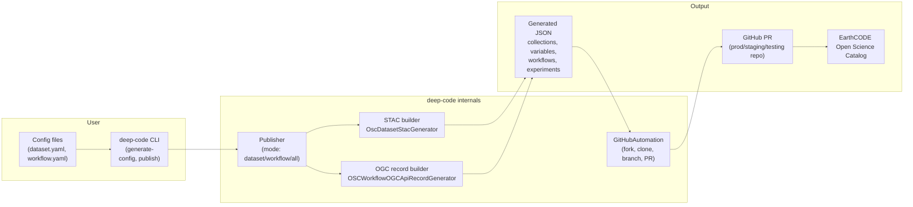

# Overview

`deep-code` is a lightweight Python CLI and API that publishes DeepESDL datasets and workflows as EarthCODE Open Science Catalog metadata. It can generate starter configs, build STAC collections and OGC API records, and open pull requests to the target EarthCODE metadata repository (production, staging, or testing).

## Features
- Generate starter dataset and workflow YAML templates.
- Publish dataset collections, workflows, and experiments via a single command.
- Build STAC collections and catalogs for Datasets and their corresponding variables automatically from the dataset metadata.
- Build OGC API records for Workflows and Experiments from your configs.
- Flexible publishling targets i.e production/staging/testing EarthCODE metadata repositories with GitHub automation.

